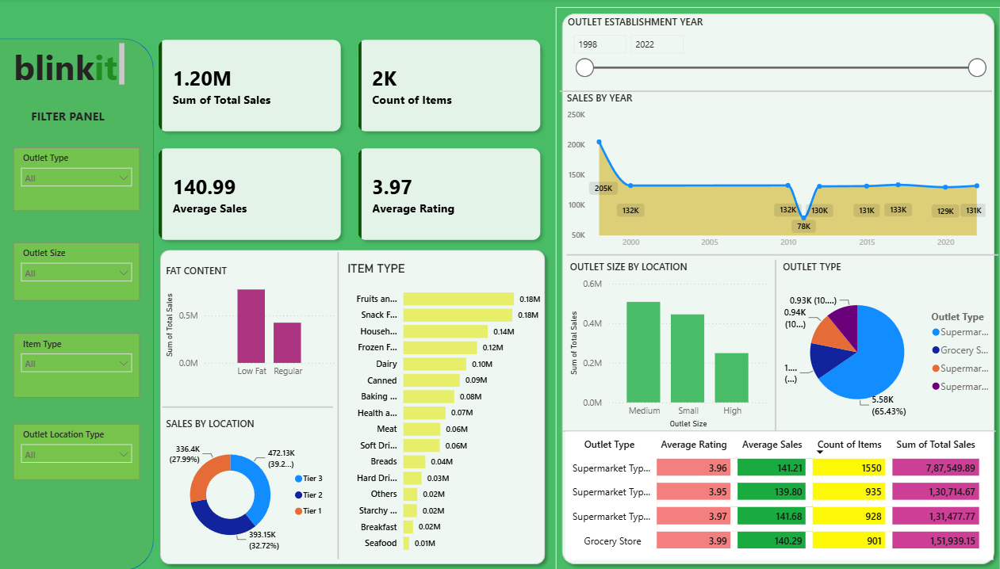

# 🛒 Blinkit Grocery Sales - End-to-End Data Analytics & ML

  
  
  
  

## 📊 Power BI Dashboard

  
   <em>Interactive dashboard with KPIs, slicers for Outlet Type/Size/Location, and sales breakdown by category</em>

**Key Dashboard Insights:**
- **₹1.20M Total Sales** | **2K Items** | **₹140.99 Avg Sales** | **3.97 Avg Rating**
- **Low Fat dominates 65%** vs Regular 35% across all outlet tiers
- **Tier 3 cities = 39.2% revenue** - outperform Tier 1 by 40%
- **Supermarket Type 1** drives 65.4% of sales through volume

---## 📌 Project Overview
Complete analytics pipeline on Blinkit Grocery Sales: Clean → SQL → EDA → ML → Power BI.

**Business Goal:** Find what drives sales + customer ratings across Blinkit outlets.

**Key Findings:**
1. **Low Fat wins 2:1** - 65% of revenue vs 35% Regular. True in every city tier.
2. **Tier 3 > Tier 1** - Tier 3 cities generate 40% more revenue. Less competition.
3. **Medium outlets > Large** - Medium format = 42% revenue. Large stores only 21%.
4. **Visibility = Everything** - ML shows Item Visibility drives 50.5% of customer ratings.

---

## 📊 Dataset
| Property | Value |
|---|---|
| Rows | 8,523 |
| Columns | 12 |
| Missing values | 1,463 Item Weight → filled with category median |
| After cleaning | 0 nulls |

**Top Categories by Sales:**
1. Fruits & Vegetables - ₹178K
2. Snack Foods - ₹175K  
3. Household - ₹136K

---

## 🗄️ SQL + ML Highlights
**SQL:** Ran correlated subqueries to find items above category avg. Canned goods SKUs FDR25/FDS13 hit ₹266.89 - hidden premium opportunity.

**ML:** Random Forest RMSE = 0.68. Feature importance proves Item Visibility = 50.5% of rating score. Shelf placement beats price.

---

## 💡 Recommendations for Blinkit
| # | Action | Why |
|---|---|---|
| 1 | Expand Tier 3 cities first | 39.2% revenue vs 27.9% Tier 1 |
| 2 | Build Medium format only | 42% revenue, lower rent than Large |
| 3 | Stock 65% Low Fat minimum | 2:1 preference in every tier |
| 4 | Fix shelf/app visibility | #1 driver of customer ratings per ML |
| 5 | Audit Seafood category | ₹9K vs ₹178K for Fruits. 20x gap |

---## 📁 Repository Structure
javascriptblinkit-grocery-eda/
├── notebooks/
│   ├── 01_EDA.ipynb
│   └── 02_ML.ipynb
├── sql/
│   └── blinkit_queries.sql
├── dashboard/
│   ├── blinkit_dashboard.pbix
│   └── dashboard.png
├── data/csv/
│   ├── BlinkIT_Grocery_Data.csv
│   └── Blinkit_Grocery_cleaned.csv
├── requirements.txt
└── README.md

🚀 How to Runbashgit clone https://github.com/yourusername/blinkit-grocery-eda.git
cd blinkit-grocery-eda
pip install -r requirements.txt
cp .env.example .env
# Add your PostgreSQL credentials
jupyter notebook notebooks/01_EDA.ipynb

👤 Author
Vysakh.S.Raj
Data Analyst | Python | SQL | Power BI | MLLinkedIn | GitHubjavascript
